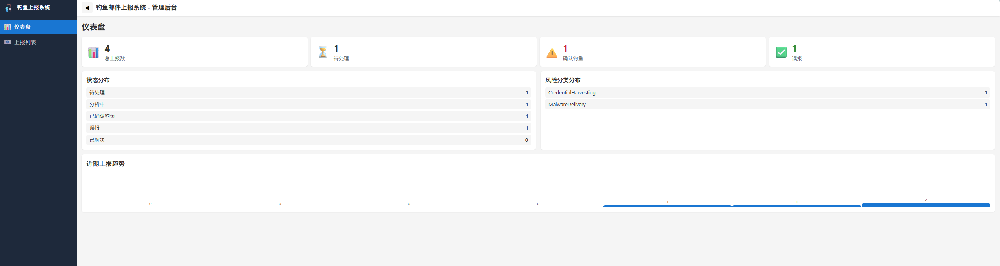
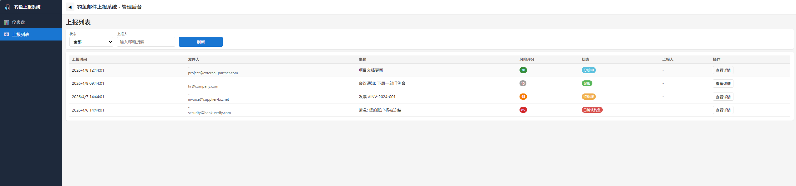
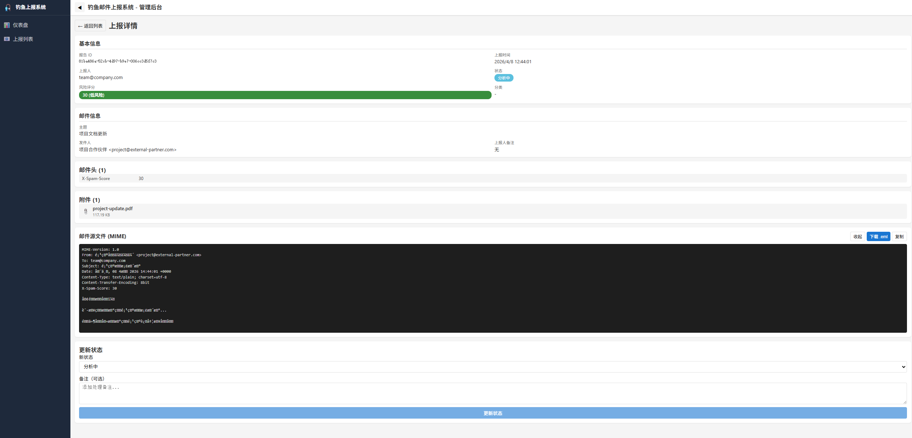

# 钓鱼邮件上报系统 (Phishing Reporter)

企业级钓鱼邮件上报系统，包含 Outlook Classic 插件和后端分析平台。

## 系统截图

| 仪表盘 | 上报列表 | 详情页 |
|:---:|:---:|:---:|
|  |  |  |

仪表盘展示统计数据和趋势，列表页支持筛选和分页，详情页可查看完整邮件源文件。

## 项目结构

```
phishing-reporter/
├── src/
│   ├── PhishingReporter/              # Outlook VSTO 插件
│   │   ├── Models/                    # 数据模型
│   │   ├── Services/                  # 业务服务
│   │   ├── Ribbon/                    # 功能区 UI
│   │   ├── Forms/                     # Windows Forms
│   │   └── Properties/                # 项目属性
│   ├── PhishingReporter.Tests/        # 插件单元测试
│   │
│   └── PhishingReporter.Backend/      # 后端服务
│       ├── PhishingReporter.Api/      # Web API
│       ├── PhishingReporter.Core/     # 核心业务逻辑
│       ├── PhishingReporter.Infrastructure/  # 基础设施
│       └── PhishingReporter.Tests/    # 后端测试
│
├── docs/                              # 文档
│   ├── ARCHITECTURE.md                # 架构文档
│   ├── DEPLOYMENT.md                  # 部署指南
│   └── USER_GUIDE.md                  # 用户手册
│
└── installer/                         # 安装程序
```

## 技术栈

### Outlook 插件
- **VSTO** (Visual Studio Tools for Office)
- **.NET Framework 4.8**
- **C#**

### 后端服务
- **ASP.NET Core 8**
- **Entity Framework Core**
- **SQL Server**
- **EWS Managed API** (Exchange Web Services)

## 开发环境准备

### 必需软件
1. **Visual Studio 2022** - 包含 VSTO 工作负载
2. **.NET Framework 4.8 SDK**
3. **.NET 8 SDK**
4. **SQL Server 2019+**
5. **Outlook 2016/2019/2021/365** (测试)

### Visual Studio 配置
1. 打开 Visual Studio Installer
2. 选择"修改"
3. 在"单个组件"中勾选：
   - Visual Studio Tools for Office (VSTO)
   - .NET Framework 4.8 开发工具
4. 安装完成

## 快速开始

### 1. 创建 Outlook 插件项目

由于 VSTO 项目需要 Visual Studio 特定模板，请按以下步骤操作：

1. 打开 Visual Studio 2022
2. 创建新项目 → 搜索 "Outlook VSTO Add-in"
3. 选择 "Outlook VSTO Add-in" 模板
4. 项目名称: `PhishingReporter`
5. 位置: `src/PhishingReporter`
6. 将本仓库的代码文件复制到生成的项目中

### 2. 创建后端项目

```bash
cd src/PhishingReporter.Backend

# 创建解决方案
dotnet new sln -n PhishingReporter.Backend

# 创建 API 项目
dotnet new webapi -n PhishingReporter.Api -o PhishingReporter.Api

# 创建核心项目
dotnet new classlib -n PhishingReporter.Core -o PhishingReporter.Core

# 创建基础设施项目
dotnet new classlib -n PhishingReporter.Infrastructure -o PhishingReporter.Infrastructure

# 添加项目引用
dotnet sln add PhishingReporter.Api
dotnet sln add PhishingReporter.Core
dotnet sln add PhishingReporter.Infrastructure

dotnet add PhishingReporter.Api reference PhishingReporter.Core
dotnet add PhishingReporter.Api reference PhishingReporter.Infrastructure
dotnet add PhishingReporter.Infrastructure reference PhishingReporter.Core
```

### 3. 安装依赖

```bash
cd PhishingReporter.Api
dotnet add package Microsoft.EntityFrameworkCore.SqlServer
dotnet add package Microsoft.Exchange.WebServices

cd ../PhishingReporter.Core
dotnet add package Microsoft.Extensions.Logging.Abstractions
```

## 配置

### 插件配置 (App.config)

```xml
<appSettings>
  <add key="ApiBaseUrl" value="https://your-server/api" />
  <add key="ApiKey" value="your-api-key" />
  <add key="RequestTimeoutSeconds" value="30" />
</appSettings>
```

### 后端配置 (appsettings.json)

```json
{
  "ConnectionStrings": {
    "DefaultConnection": "Server=localhost;Database=PhishingReporter;Trusted_Connection=True"
  },
  "Exchange": {
    "EwsUrl": "https://exchange.company.com/EWS/Exchange.asmx",
    "Username": "service-account@company.com",
    "Password": "password",
    "ArchiveFolderName": "Phishing Reports"
  }
}
```

## 功能

### MVP 功能
- ✅ 一键上报钓鱼邮件（功能区按钮 + 右键菜单）
- ✅ 自动提取邮件元数据（发件人、收件人、主题等）
- ✅ 导出原始 EML 格式（包含完整邮件头）
- ✅ 上报确认对话框（可添加备注）
- ✅ 后端 API 存储和存档
- ✅ Exchange 存档邮箱
- ✅ 成功/失败反馈

### 后续迭代
- 基础钓鱼特征分析
- 安全团队通知（邮件/Teams）
- 管理后台 Web 界面
- 统计报表

## 文档

- [架构设计](docs/ARCHITECTURE.md)
- [部署指南](docs/DEPLOYMENT.md)
- [用户手册](docs/USER_GUIDE.md)

## 许可证

内部使用 - 企业专用